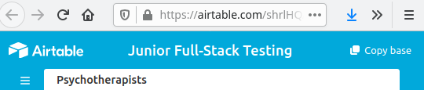
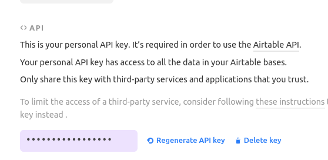
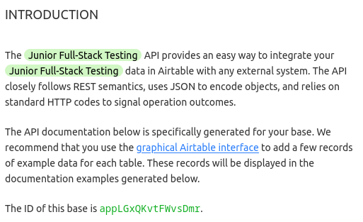

# Airtable parcer for Meta!
 
>*Преа́мбула: в связи со спецификой условий выполнения задачи, код далее написан исходя из  следующих принципов:*
>   - *Больше, не значит лучше.*
>   - *Сначала функционал, потом оптимизация.*
>   - *Делаешь, как понимаешь.*<br>
>
>*Подробности специфики не уточняю, однако автор полностью согласен со всей критикой в части, например, оптимизации кода.*

<br>

## Общее описание.

### Код написан по заданию [Meta](https://bemeta.co/).

Работаем с Airtable [таблицей терапевтов](https://airtable.com/shrlHQArEK0WNdylo).

<br>

**Поставленные задачи:**
- Развернуть базовый проект по согласованному стеку технологий.
- Написать CLI скрипт, который будет выгружать данные из таблицы Airtable в PostgreSQL.
- Этот же скрипт при повторном запуске должен определять:
    - появление новой записи в Airtable и догружать ее в базу данных;
    - изменять уже существующие записи, если они изменились в Airtable; 
    - удалять записи, если их удалили в Airtable.
- При каждом запуске скрипта нужно сохранять в отдельную таблицу БД сырые данные из Airtable, при обязательных полях таблицы:
    - id (инкрементальный счетчик);
    - дата запуска;
    - выгруженные данные.

На фронтеде нужно создать страницу терапевта по приложенному мокапу, где будут отображаться все выгруженные данные по каждому терапевту:


<br>

**Согласованный стек технологий:**
Django 3.0 и выше, Django ORM, PostgreSQL, Bootstrap.


## 1. Подготовка. 
<br>

Для того чтобы реализовать весь запрошенный функционал, мы будем работать с копией предложенной Airtable [таблицы терапевтов](https://airtable.com/shrlHQArEK0WNdylo). Для этого...

1.1 Заведите [учетную запись](https://airtable.com/login) Airtable.

1.2 Перейдите в [исходную таблицу](https://airtable.com/shrlHQArEK0WNdylo) и скопируйте ее себе в учетную запись. 



1.3 Перейдите в раздел `Account` своего Airtable профиля и сгенерируйте `API key`.



Запоминте его, он нам очень пригодится. ;)

1.4 В скопированной таблице перейдите в `Help->API documentation`. Запомните `ID` своей базы данных:


Часть дела сделано, поскакали дальше... 

## 2. Установка. 
<br>

Для корректной работы вам нужен **Python 3.7 или выше**.

2.1 Скачайте код:<br>
`git clone https://github.com/Sam1808/Airtable-4-Meta.git`

2.2 Создайте виртуальное окружение, [активируте](https://devpractice.ru/python-lesson-17-virtual-envs/#p33) его и перейдите в папку `Airtable-4-Meta/airtable4meta`:<br>
`python3 -m venv _название_окружения_`

2.3 Обновите установщик пакетов `pip` (*не помешает*) и установите зависимости:<br>
`pip install --upgrade pip`<br>
`pip install -r requirements.txt`

Будьте внимательны и почитайте про [psycord-binary](https://www.psycopg.org/docs/install.html#psycopg-vs-psycopg-binary).

2.4 Если необходимо, установите `PostgreSQL`.

2.5 Создайте `пользователя`, при помощи которого будем соединяться с базой данной из Django, и собственно `базу данных` для проекта.

2.6 Настраиваем раздел `DATABASES` конфигурационного файла `airtable4meta/settings.py`.

```
DATABASES = {
    'default': {
        'ENGINE': 'django.db.backends.postgresql_psycopg2',
        'NAME': 'имя базы данных',
        'USER' : 'имя пользователя',
        'PASSWORD' : 'пароль пользователя',
        'HOST' : '127.0.0.1',
        'PORT' : '5432',
    }
}
```

2.7 Подготовьте миграции и примените их: <br>
`python manage.py makemigrations` <br>
`python manage.py migrate `

2.8 Создайте суперпользователя: <br>
`python manage.py createsuperuser`

2.9 Запустите web-сервер, просто для того, чтобы убедиться что все предыдущие шаги сделаны правильно: <br>
`python manage.py runserver` <br>
Сервер будет доступен по адресу `http://127.0.0.1:8000/`. Перейдите в Django-admin `http://127.0.0.1:8000/admin` , убедитесь что пароль суперпользователя работает, что есть сущности в базе данных. Пока ещё все пусто, но это мы быстро исправим.

2.10 Создайте файл `.env` со следующим содежимым: 
```
AIRTABLE_API_KEY="ваш API KEY п.1.3"
AIRTABLE_BASE_ID="ID вашей Airtable базы п.1.4"
AIRTABLE_NAME="название таблицы, которую будем парсить"
```

2.11 Выпейте хорошего крепкого кофе, вы сделали почти все... 

## 3. Запуск.

3.1 Скрип, который будет парсить нашу табличку, запускается очень просто: <br>
`python manage.py load_data`
